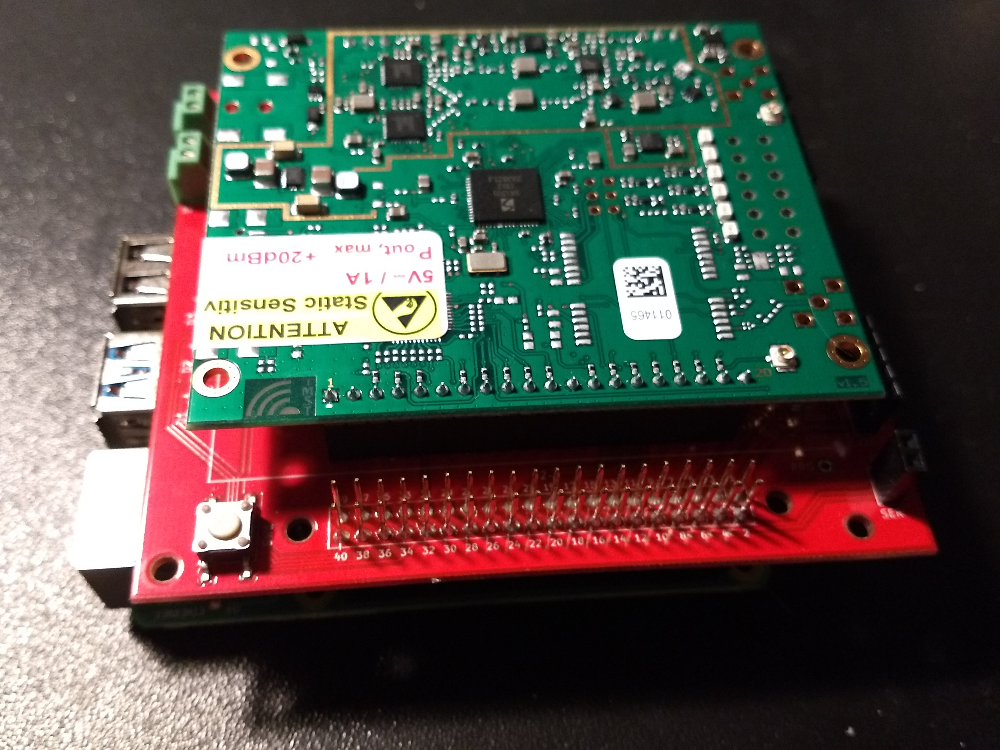

## Equipment: 

* Raspberry Pi 4 Model B with 4GB RAM (2019 Model) + USB typeC + Power supply
(This tutorial should also work with other models, however it has not been tested.)

* Antenna collinear 868 Mhz 869 mhz LORAWAN LORA
(This tutorial should also work with other models, however it has not been tested.)

* C880A LoRaWAN Gateway Backplane v2.1
(This tutorial should also work with other models, however it has not been tested.)

* IMST IC880A-SPI 

* GN800GU GLONASS GPS receiver 
(This tutorial should also work with other models, however it has not been tested.)

***

## Install Raspbian
The process of installation is straight-forward, nothing special about it. There are many tutorials around.
 
* Download an image of Raspbian buster from official website - www.raspberrypi.org/

* Install operating system - instructions https://www.raspberrypi.org/documentation/installation/installing-images/README.md

* Update raspbian and Install GIT 

```console
$ sudo apt-get update
$ sudo apt-get upgrade
$ sudo apt-get install git
```
* Enter configuration mode
```console
$ sudo raspi-config
```
* Enable interface SPI
Interfacing Options -> SPI

***

## Connect Equipment together
### Attach backplane holders


### Connect backplane


### Connect  IMST IC880A-SPI 


### Connect Antenna


### Connect GPS


### !!!NB!!! Antena has to be always connected otherwise you can damage your equipment!

***

## Install Gateway Software

To turn your raspberry into a gateway a spepcial softwere is used. More detail about the software and installation process https://github.com/ttn-zh/ic880a-gateway/tree/spi

### Instalation
Clone the installer and start the installation

```console
  $ git clone -b spi https://github.com/ttn-zh/ic880a-gateway.git ~/ic880a-gateway
  $ cd ~/ic880a-gateway
  $ sudo ./install.sh spi
```

Follow the instructions on the screen. If you want to use USB GPS you can skip setting gps coordinates

After the installation your Raspberry device will be rebooted.

### Configuration

Global config file located /opt/ttn-gateway/bin/global_conf.json


### Logging

*logs are stored in /var/log/syslog
command to check logs in real time : tail -f /var/log/syslog

***

## GPS Coordinates
Extra: Using the onboard GPS data as gateway location
The installation package uses “fake_gps” by default. This means that the program will ignore the GPS data received from the onboard GPS module. In order to use “real” GPS, one line  "fake_gps": false,  should be added to the /opt/ttn-gateway/bin/local_conf.json file in order to override the default setting in the global_conf.json file. The result should look like this:

To use USB GPS dongle specify your usb device, usually /dev/ttyACM0 in configuration file

EXAMPLE: 
/* GPS configuration */
a unit is most commonly defined as a class, or a group of related functions often called a module. Keeping units relatively small is claimed to provide critical benefits, including:        "gps_tty_path": "/dev/ttyACM0",
        "fake_gps": false,
        "ref_latitude": 10,
        "ref_longitude": 20,
        "ref_altitude": -1,

***

## Register your gateway on TTN

* Login to thethingsnetwork.org Console
* Click on Gateways -> register gateway
* Enable checkbox I'm using the legacy packet forwarder
* Enter your Gateway EUI (if is printed on start and end of the installer, also can be found in the log file /var/log/syslog)
* Enter any description
* Select Europe 868Mhz as frequency plan
* Select the correct antenna placement according to your plans (indoor or outdoor)
* Confirm clicking Register gateway

###Registration example


